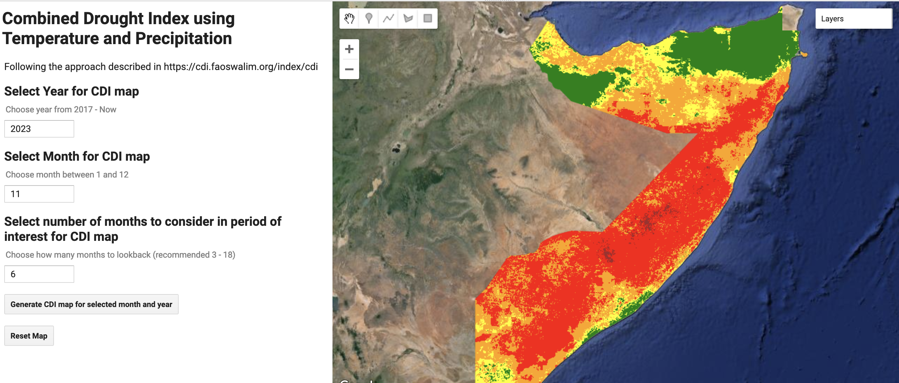

# Google Earth Engine apps for flood and drought monitoring

While these scripts (and apps) focus on Somalia, they can be changed to other regions by changing the area of interest (`aoi`):

```javascript
var dataset = ee.FeatureCollection('FAO/GAUL/2015/level0');
var somalia_feature = dataset.filter(ee.Filter.eq("ADM0_NAME", "Somalia")) // change "Somalia" to another country
var aoi = somalia_feature.first().geometry();
```

### `flood.js`


[`flood.js`](flood.js) contains a Google Earth Engine script which measures flood using the Normalized Difference Water index calculated using [Sentinel-2 data](https://developers.google.com/earth-engine/datasets/catalog/COPERNICUS_S2_SR).

The app is available at [https://large-earth-model.projects.earthengine.app/view/somalia-flood](https://large-earth-model.projects.earthengine.app/view/somalia-flood).

### `drought.js`



[`drought.js`](drought.js) contains a Google Earth Engine script which calculates the Combined Drought Index, as defined [in this manual](https://cdi.faoswalim.org/uploads/CDI-Manual.pdf). It looks at runs of above average temperature or below average precipitation within a period of interest and compares this to historical means.

The app is available at [https://large-earth-model.projects.earthengine.app/view/somalia-cdi](https://large-earth-model.projects.earthengine.app/view/somalia-cdi).
